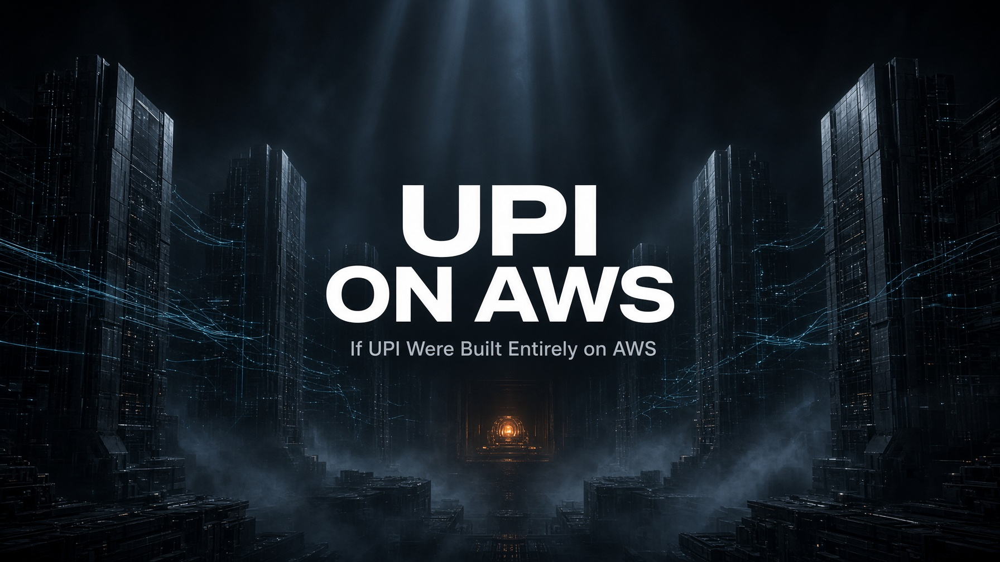
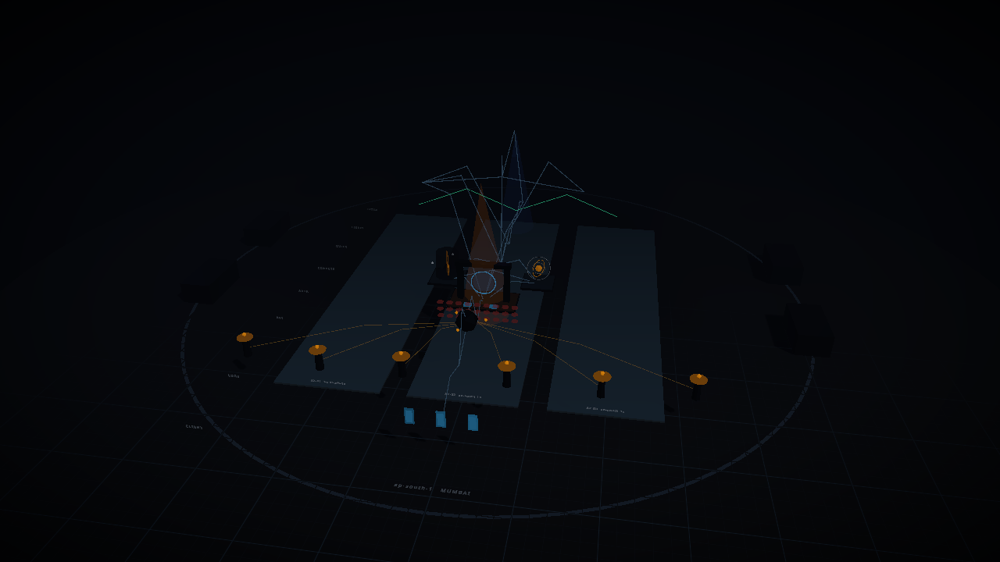
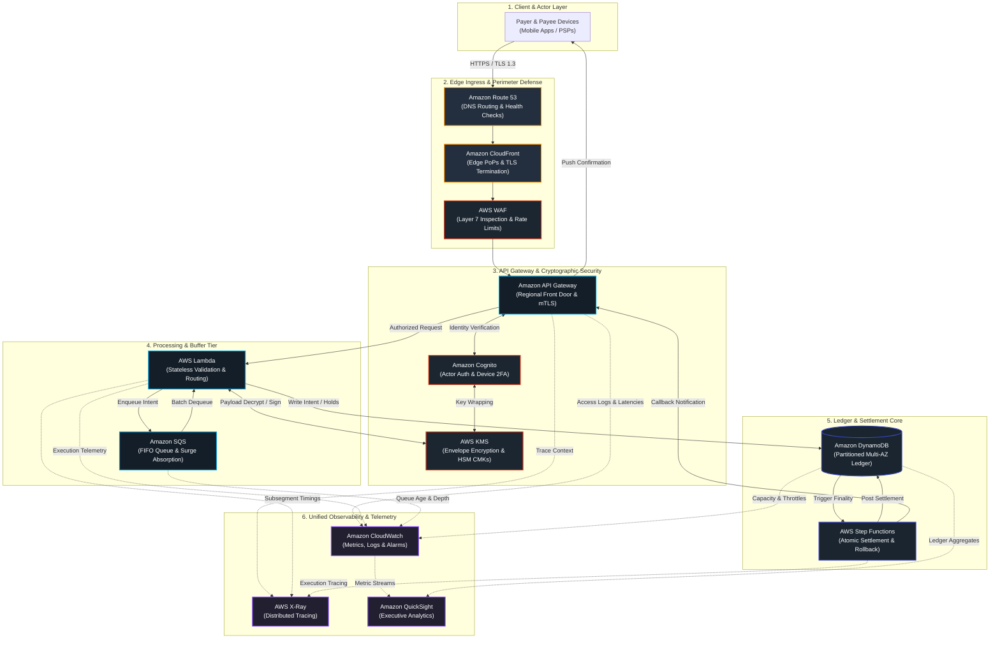
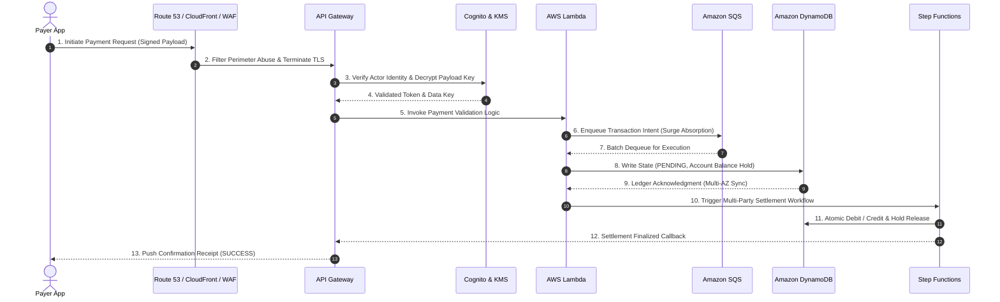

# UPI on AWS

<div align="center">



**Architectural Digital Twin: India's Unified Payments Interface Reimagined on Amazon Web Services**

[](https://aws.amazon.com/)
[](https://react.dev/)
[](https://threejs.org/)
[](https://www.typescriptlang.org/)
[](https://tailwindcss.com/)
[-FF9900?style=for-the-badge&logo=amazon-aws&logoColor=white)](https://aws.amazon.com/about-aws/global-infrastructure/regions_az/)

</div>

---

## Executive Summary

**UPI on AWS** is an interactive, cinematic 3D digital twin of a nationwide, high-throughput instant payment network modeled on AWS cloud-native primitives.

India's Unified Payments Interface (UPI) processes billions of financial transactions monthly, demanding sub-second latency, zero-trust cryptographic security, multi-Availability Zone (Multi-AZ) durability, and near-infinite elastic scalability. This project visualizes what that distributed payment infrastructure looks like when architected end-to-end on Amazon Web Services—spanning edge routing, cryptographic verification, serverless execution, asynchronous queuing, distributed ledgers, and real-time observability.

<div align="center">



*Interactive 3D spatial viewport visualizing Multi-AZ nodes, traffic flows, and operational telemetry in `ap-south-1` (Mumbai).*

</div>

---

## System Architecture Topology

The entire payment rail is decomposed into modular, highly resilient cloud services deployed across multiple availability zones in the **AWS Asia Pacific (Mumbai) `ap-south-1`** region:



---

## End-to-End Payment Lifecycle



---

## Core Engineering Principles

### 1. Zero-Trust Security & Perimeter Defense
- **Perimeter Defense**: **AWS WAF** guards API surfaces against Layer 7 volumetric attacks, malicious payloads, and unauthorized CIDR blocks.
- **Identity & Authentication**: **Amazon Cognito** handles actor tokens, device verification, and certificate-backed 2FA challenges.
- **Envelope Encryption**: **AWS KMS** manages Customer Master Keys (CMKs) inside FIPS 140-3 HSM boundaries to encrypt financial payloads at rest and in flight.

### 2. Multi-AZ Fault Tolerance & Elastic Edge
- **Global Ingress**: **Amazon CloudFront** Anycast PoPs terminate TLS at the edge to minimize client RTT.
- **Automated Failover**: **Amazon Route 53** provides latency routing and automatic health checks across redundant regional endpoints.
- **Availability Zone Resilience**: Core processing, messaging, and databases run across three distinct availability zones (`ap-south-1a`, `ap-south-1b`, `ap-south-1c`), guaranteeing automated failover if an AZ degrades.

### 3. Asynchronous Decoupling & Queue Buffering
- **Surge Damping**: **Amazon SQS** absorbs high-velocity transaction bursts, decoupling the synchronous ingress API from downstream ledger writes to prevent system brownouts.
- **Serverless Concurrency**: **AWS Lambda** scales elastically per request to authorize, route, and calculate fees without server provisioning overhead.

### 4. Distributed Ledger & Orchestrated Settlement
- **High-Throughput Persistence**: **Amazon DynamoDB** provides single-digit millisecond reads/writes with partitioned scaling.
- **Transactional Finality**: **AWS Step Functions** orchestrates atomic, two-phase settlement workflows with compensating rollback handlers for partial failures.

### 5. Unified Telemetry & Distributed Tracing
- **Operational Metrics**: **Amazon CloudWatch** tracks transactions per second (TPS), latency percentiles (p50, p95, p99), error budgets, and queue depths.
- **Distributed Tracing**: **AWS X-Ray** correlates every transaction hop with a unique trace ID across edge, compute, and database boundaries.

---

## AWS Service Mapping Matrix

| Layer | Component | AWS Service | Architectural Role | Latency Profile |
| :--- | :--- | :--- | :--- | :--- |
| **Edge** | CDN / PoP Ingress | **Amazon CloudFront** | Anycast edge TLS termination, origin shielding, read caching | 8–18 ms |
| **Edge** | Global DNS & Failover | **Amazon Route 53** | Latency-based DNS routing and automated health check failover | 4–12 ms |
| **Security** | Perimeter Firewall | **AWS WAF** | Layer 7 request inspection, rate limiting, and bot mitigation | 1–3 ms |
| **API** | Regional API Front Door | **Amazon API Gateway** | Endpoint routing, usage plans, request validation, mTLS | 6–15 ms |
| **Security** | Identity & Credentials | **Amazon Cognito** | PSP authentication, device fingerprinting, and 2FA tokens | 12–28 ms |
| **Security** | Key Management & Crypto | **AWS KMS** | Envelope encryption, digital signing, and HSM key protection | 3–8 ms |
| **Compute** | Serverless Business Logic| **AWS Lambda** | Stateless transaction authorization, validation, and posting | 8–22 ms |
| **Messaging**| Ingestion & Buffer Queue | **Amazon SQS** | Elastic decoupling, surge absorption, dead-letter queues | Managed Buffer |
| **Ledger** | Distributed Storage | **Amazon DynamoDB** | Partitioned transaction state, account holds, and idempotency store | 4–12 ms |
| **Settlement**| Transaction Orchestration | **AWS Step Functions** | Multi-party debit/credit workflows and compensating transactions | 15–40 ms |
| **Telemetry**| Metrics & Logging | **Amazon CloudWatch** | Centralized time-series metrics, access logs, and alarm triggers | Real-time / 1s |
| **Telemetry**| Request Tracing | **AWS X-Ray** | End-to-end distributed trace stitching and flame graphs | Continuous |
| **Analytics**| Business Intelligence | **Amazon QuickSight** | Transaction volume analytics and financial reporting | Batch / SPICE |

---

## Interactive 3D Digital Twin Capabilities

- **3D Spatial Navigation**: Orbit, pan, and zoom around the entire cloud architecture with smooth camera transitions.
- **Component Deep Dive**: Inspect any AWS node to examine its operational role, scaling behavior, connection graph, and latency profile.
- **Real-Time Simulation Modes**:
  - **Standard Payment Flow**: Follows a single payment packet through the complete hop sequence.
  - **High-Traffic Surge**: Simulates traffic spikes with dynamic particle congestion and SQS buffer expansion.
  - **Multi-AZ Failover**: Simulates an availability zone failure (`ap-south-1a`) and demonstrates traffic rerouting to `ap-south-1b` and `ap-south-1c`.
  - **Distributed Trace Mode**: Highlights the latency and timing waterfall across hops using simulated AWS X-Ray telemetry.
- **Live Metrics HUD**: Real-time dashboard displaying simulated RPS, active connections, p99 latency, success rate, and queue backlog.
- **Guided Architectural Narrative**: Seven-part guided tour explaining the architectural rationale behind each layer.

---

## Technology Stack

- **Frontend Core**: [React 19](https://react.dev/) + [TanStack Start](https://tanstack.com/start) & [TanStack Router](https://tanstack.com/router)
- **3D Rendering & WebGL**: [Three.js](https://threejs.org/) + [@react-three/fiber](https://r3f.docs.pmnd.rs/) + [@react-three/drei](https://github.com/pmndrs/drei)
- **Post-Processing Pipeline**: [@react-three/postprocessing](https://github.com/pmndrs/react-postprocessing) (Bloom, Depth of Field, Vignette)
- **Motion & Interpolation**: [GSAP](https://greensock.com/gsap/) + requestAnimationFrame render loops
- **State Management**: [Zustand](https://github.com/pmndrs/zustand)
- **Styling & Design System**: [Tailwind CSS v4](https://tailwindcss.com/) + [Radix UI](https://www.radix-ui.com/) + [Lucide Icons](https://lucide.dev/)
- **Bundling & Tooling**: [Vite](https://vite.dev/) + [TypeScript 5.7](https://www.typescriptlang.org/)

---

## Getting Started

### Prerequisites

- **Node.js**: `v20.x` or `v22.x` (recommended)
- **Package Manager**: `npm` (v10+) or `bun`

### Installation & Local Run

1. **Clone the repository**:
   ```bash
   git clone https://github.com/AWSSBGAtria/upi-on-aws.git
   cd upi-on-aws
   ```

2. **Install dependencies**:
   ```bash
   npm install
   ```

3. **Launch the development server**:
   ```bash
   npm run dev
   ```

4. **Access the application**:
   Navigate to [http://localhost:8080](http://localhost:8080) in any modern WebGL2-compatible browser (Chrome, Edge, Firefox, Safari).

---

## Available Scripts

| Command | Purpose |
| :--- | :--- |
| `npm run dev` | Starts Vite dev server bound to `0.0.0.0:8080` with application environment injection |
| `npm run build` | Produces an optimized production build with TypeScript compilation |
| `npm run preview` | Previews the production bundle locally |
| `npm run preview:restart` | Restarts background preview server on port `8081` |
| `npm run typecheck` | Validates TypeScript types across the entire codebase (`tsc --noEmit`) |
| `npm run lint` | Lints source files using ESLint |
| `npm run format` | Enforces uniform formatting with Prettier |
| `npm test` | Runs unit tests for verification and invariants |

---

## Repository Structure

```
upi-on-aws/
├── artifacts/
│   └── imagine_images/         # High-resolution architectural renders & hero banners
├── screenshots/                # Application preview screenshots & visual regression baselines
├── public/                     # Static icons, favicons, and OpenGraph assets
├── scripts/                    # Build, environment wrapper, and verification scripts
├── server/                     # Server middleware
├── src/
│   ├── components/
│   │   ├── experience/         # 3D canvas, Three.js scene, camera rig, shaders, nodes, flows
│   │   └── overlay/            # 2D HUD, metrics display, navigation bars, modal panels
│   ├── lib/
│   │   ├── experience/         # Architecture definitions, simulation models, state store
│   │   ├── auth/               # Authentication & security definitions
│   │   └── utils.ts            # Utility helpers
│   ├── routes/
│   │   ├── __root.tsx          # Root shell layout
│   │   └── index.tsx           # Primary application route
│   ├── router.tsx              # Router initialization & error handling
│   └── styles.css              # Global styles & Tailwind CSS directives
├── startup.sh                  # Sandbox startup and revival script
├── tsconfig.json               # TypeScript configuration
├── vite.config.ts              # Vite configuration
└── package.json                # Project dependencies and script metadata
```

---

## Deployment

- **Vercel**: Pre-configured with TanStack Start nitro preset for edge-deployed serverless execution.
- **AWS Amplify / AWS ECS**: Can be deployed as a static Single Page Application (SPA) backed by Amazon CloudFront and S3, or containerized within Amazon ECS / AWS Fargate behind an Application Load Balancer.

To compile for production:
```bash
npm run build
```

---

## Architectural Disclaimer

This repository is an **educational architectural model and interactive digital twin**. It provides an engineering reference pattern for designing high-volume, mission-critical distributed systems using AWS services. It is not affiliated with, endorsed by, or operated by the National Payments Corporation of India (NPCI).

---

## Organization & Acknowledgments

Developed by **AWS Student Building Group / AWS Cloud Club Atria** ([Atria Institute of Technology](https://atria.edu/)).

- GitHub: [@AWSSBGAtria](https://github.com/AWSSBGAtria)
- Repository: [AWSSBGAtria/upi-on-aws](https://github.com/AWSSBGAtria/upi-on-aws)

---

## License

This project is licensed under the [MIT License](LICENSE).
